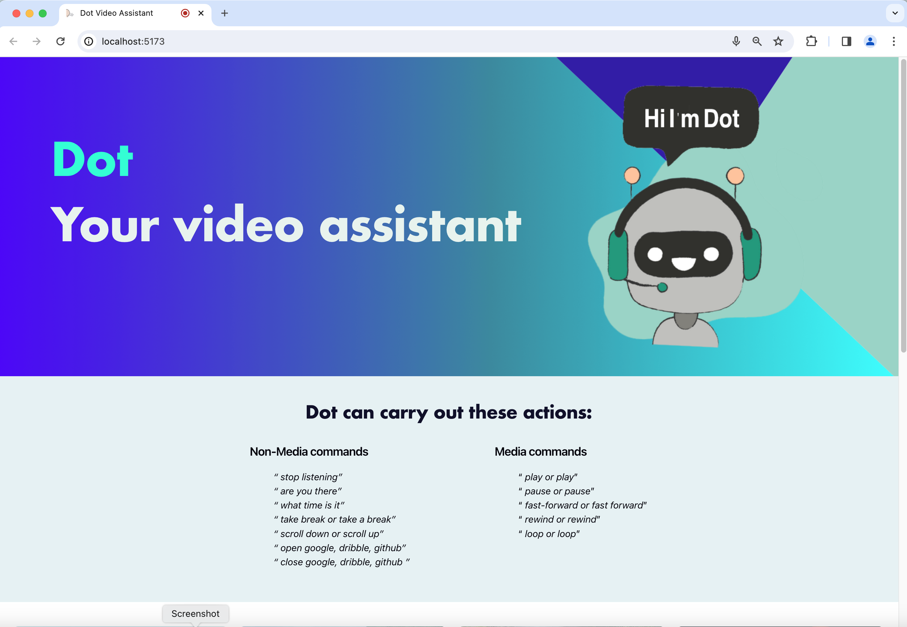

# Dot-Voice-Assistant

# Dot Voice Assistant Application

## :rocket:  Overview
`Dot Voice Assistant Application` is a sophisticated, voice-controlled application developed using modern web technologies such as Vite, React, MUI Joy, Annyang, and JavaScript. 

It leverages the power of voice recognition to interpret user commands and perform a wide array of tasks. These tasks could range from playing videos, opening web windows, and even requesting the time or any other tasks that can be automated, to provide a seamless user experience.

The application's name, `Dot`, signifies its design philosophy of being minimalistic and straightforward, focusing on delivering core functionalities without unnecessary complexities. 

Built with Vite, this application is primarily a web application. However, the possibility of it being a mobile application cannot be ruled out if React Native is also used. 

A notable feature of the application is the `VoiceMediaSection` component, suggesting the application's capability to play media files, controlled via voice commands.

## :pencil: Design Pattern: Command Pattern

The application  uses the Command design pattern. This pattern is a behavioral design pattern that turns a request into a stand-alone object that contains all information about the request. This transformation lets you pass requests as method arguments, delay or queue a request's execution, and support undoable operations.

In the context of this application, the Command pattern is used to encapsulate all the information needed to perform an action or trigger an event at a later time. This information includes the method name, the object that owns the method, and values for the method parameters.

For example, the commands are encapsulated in functions such as `dotStopListening`, `dotTakeBreak`, `scrollDownWindow`, `scrollUpWindow`, `openWindow`, `closeWindow`, `playVideo`, `stopVideo`, `pauseVideo`, `loopVideo`, `fastForwardVideo`, and `rewindVideo`. These functions are then exported for use in other parts of the application, which can call these functions to execute the corresponding commands.

This design pattern decouples the objects that send a request from the ones that receive and execute it, providing flexibility and easy extension of the application. It also makes it easier to add new commands to the application, as you don't have to change existing code.

##  :stars: Features
The `Dot Voice Assistant Application` has the following features:

- **Voice Control**: The application uses voice recognition to interpret user commands. This allows users to control the application and perform various tasks using voice commands.

- **Task Automation**: The application can perform a wide array of tasks based on user commands. These tasks could range from 
- opening/closing `google, dribble, and github` windows, scrolling windows, fetching the time, check dot's active state, pausing/stop dot.

- **Media Automation**: The application has the capability to play, pause, stop, loop, fast-forward, and rewind  videos, which is  controlled via voice commands, providing a seamless user experience.

- **Minimalistic Design**: The application's name, `Dot`, signifies its design philosophy of being minimalistic and straightforward. It focuses on delivering core functionalities without unnecessary complexities.

- **Web Application**: Built with Vite and React, this application is primarily a web application. However, the possibility of it being a mobile application cannot be ruled out if React Native is also used.

##  :gear:  Technologies Used
- **JavaScript**: The primary programming language used for developing the application.

- **React**: A JavaScript library for building user interfaces.

- **Vite**: A build tool that provides a faster and leaner development experience for modern web projects.

- **MUI Joy**: A set of React components for faster and simpler web development.

- **Annyang**: A tiny JavaScript SpeechRecognition library that lets your visitors control your site with voice commands.

- **ESLint**: A tool for identifying and reporting on patterns found in ECMAScript/JavaScript code.

- **Vitest**: A test runner designed for Vite.

- **@types/react and @types/react-dom**: TypeScript definitions for React and ReactDOM.

- **@vitejs/plugin-react**: A Vite plugin that provides React fast refresh and JSX support.

- **eslint-plugin-react and eslint-plugin-react-hooks**: ESLint rules for React and React hooks.

- **eslint-plugin-react-refresh**: An ESLint plugin that enforces React Refresh compatible code.
 

## 🏞️  Images 
 &nbsp;

&nbsp;

